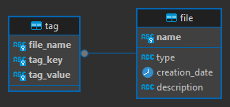

# Specs
- Operating System: Windows 11

- Programming language: Python, SQL, HTML + CSS

- Web-framework: Flask + Jinja2

- Run-time environment: Python 3.10

- Database: PostgreSQL Server 16.0.1


- Storage: SSD/Folder (File System on top of block storage)
- Packages:
```
$ pip freeze
blinker==1.6.3
click==8.1.7
colorama==0.4.6
Flask==3.0.0
itsdangerous==2.1.2
Jinja2==3.1.2
MarkupSafe==2.1.3
psycopg2==2.9.9
python-dotenv==1.0.0
Werkzeug==3.0.0
```
- HTTP Paths:
    - / (GET): Optional Parameter results that stores the results from a search. Multiple results are concatenated using & repeated use of results. These values are used to populate the search section.
    - /search (GET): Expects a parameter searchValue that is populated by the browser when the search form is submitted. Uses the searchValue to query the database to find files that match the query either in the filename or in the description.
    - /upload (POST): Called by the browser when the submit button of the file upload form is pressed. Expects the file data in the http data section. Saves the file to disk.
    - /add-tag (POST): Called by the browser when the submit button of the tag upload form is pressed. Adds a tag to the database for a file.


